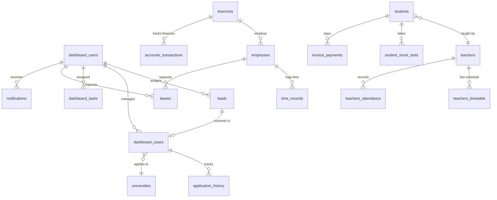
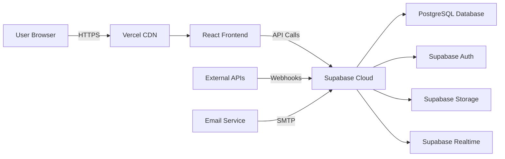

# GSL Pakistan CRM - Product Specification Document

**Version:** 1.0  
**Last Updated:** December 30, 2025  
**Project Name:** GSL Pakistan CRM  
**Tech Stack:** React 18, TypeScript, Vite, Tailwind CSS, Supabase

---

## Table of Contents

1. [Executive Summary](#executive-summary)
2. [Product Overview](#product-overview)
3. [System Architecture](#system-architecture)
4. [User Roles & Permissions](#user-roles--permissions)
5. [Core Features & Modules](#core-features--modules)
6. [Technical Specifications](#technical-specifications)
7. [Data Models](#data-models)
8. [Security & Authentication](#security--authentication)
9. [Integration & APIs](#integration--apis)
10. [Deployment & Infrastructure](#deployment--infrastructure)
11. [Non-Functional Requirements](#non-functional-requirements)

---

## Executive Summary

The **GSL Pakistan CRM** is a comprehensive customer relationship management system designed specifically for educational consultancy and coaching services. It centralizes student recruitment, visa processing, coaching class management, employee administration, HR operations, financial tracking, B2B SaaS partnerships, marketing automation, task management, and support ticketing into a unified web-based platform.

### Key Objectives

- **Streamline student recruitment** and visa application processes
- **Manage coaching classes** with timetables, attendance, and performance tracking
- **Automate HR operations** including onboarding, attendance, and payroll
- **Track financial transactions** with multi-currency support
- **Enable B2B partnerships** through controlled SaaS access
- **Integrate marketing channels** for lead capture and campaign tracking
- **Improve collaboration** through task management and support ticketing

---

## Product Overview

### Target Users

| User Type | Primary Functions | Access Level |
|-----------|------------------|--------------|
| **Super Admin** | System configuration, user management, full access | Complete system access |
| **Admin** | Module management, reporting, oversight | Full operational access |
| **Counselor** | Lead management, student applications, visa tracking | Study abroad module |
| **Teacher** | Class schedules, attendance, student progress | Coaching module |
| **HR Staff** | Recruitment, onboarding, leave management | HR module |
| **Accountant** | Financial records, payroll, expense tracking | Accounts module |
| **Employee** | Task management, attendance logging | Limited access |
| **B2B Partner** | Lead submission, quota tracking, reports | Controlled SaaS access |
| **Student/Candidate** | Application status, document submission | Portal access |

### Value Proposition

- **All-in-One Solution**: Eliminates the need for multiple disconnected systems
- **Role-Based Access**: Ensures data security and appropriate access levels
- **Real-Time Updates**: Instant notifications and live data synchronization
- **Scalable Architecture**: Supports multi-branch operations and B2B partnerships
- **Mobile Responsive**: Access from any device, anywhere
- **Automated Workflows**: Reduces manual tasks and improves efficiency

---

## System Architecture

### Technology Stack

#### Frontend
- **Framework**: React 18.2.0
- **Language**: TypeScript 5.7.2
- **Build Tool**: Vite 5.0.0
- **Styling**: Tailwind CSS 3.4.6
- **UI Components**: Radix UI primitives
- **Routing**: React Router DOM 6.0.2
- **Charts**: Recharts 2.15.2
- **PDF Generation**: jsPDF 3.0.3 with jsPDF-AutoTable
- **Excel Processing**: XLSX 0.18.5
- **QR Code**: qrcode.react 4.2.0

#### Backend & Database
- **Backend as a Service**: Supabase
- **Database**: PostgreSQL (via Supabase)
- **Authentication**: Supabase Auth (JWT-based)
- **Storage**: Supabase Storage
- **Real-time**: Supabase Realtime subscriptions

#### Deployment
- **Frontend Hosting**: Vercel
- **Backend/Database**: Supabase Cloud
- **CI/CD**: Automated deployment via Vercel

### Application Structure

```
gsl-crm/
├── src/
│   ├── components/          # Reusable UI components
│   ├── pages/               # Page-level components
│   │   ├── Dashboard/       # Main dashboard
│   │   ├── Leads/           # Lead management
│   │   ├── Students/        # Student records
│   │   ├── Teachers/        # Teacher management
│   │   ├── Cases/           # Case tracking
│   │   ├── Services/        # Service offerings
│   │   ├── Finances/        # Accounts module
│   │   ├── HRM/             # HR management
│   │   ├── DailyTasks/      # Task management
│   │   ├── Leaves/          # Leave requests
│   │   ├── Universities/    # University database
│   │   ├── Messenger/       # Internal messaging
│   │   ├── Reports/         # Analytics & reports
│   │   ├── Calendar/        # Event calendar
│   │   ├── Profile/         # User profiles
│   │   ├── Users/           # User management
│   │   ├── Employees/       # Employee records
│   │   ├── SuperAdmin/      # Super admin panel
│   │   ├── Login/           # Authentication
│   │   └── Public/          # Public forms
│   ├── hooks/               # Custom React hooks
│   ├── lib/                 # Utility libraries
│   ├── types/               # TypeScript definitions
│   └── styles/              # Global styles
├── supabase/
│   └── migrations/          # Database migrations (58+ files)
├── api/                     # API integrations
└── db/                      # Database utilities
```

---

## User Roles & Permissions

### Authentication & Session Management

- **Authentication Method**: Supabase Auth with email/password
- **Session Duration**: Active with 5-minute idle timeout
- **User Status Validation**: Active, Dormant, Inactive
  - Dormant and Inactive users are automatically logged out
- **Real-time Auth State**: Subscription-based auth state monitoring

### Role-Based Access Control (RBAC)

The system implements granular role-based permissions:

#### Super Admin
- Full system access and configuration
- User creation and role assignment
- Module activation/deactivation
- System-wide settings management
- Access to Super Admin dashboard

#### Default Users
- Role-specific module access
- Permissions: View, Add, Edit, Delete (per role)
- Activity logging with timestamps
- Password reset capabilities

### User Account Lifecycle

1. **Creation**: Admin creates user with assigned role
2. **Activation**: User receives credentials and activates account
3. **Active**: Full access based on role permissions
4. **Dormant**: Temporary suspension (auto-logout on login attempt)
5. **Inactive**: Permanent deactivation (auto-logout on login attempt)

---

## Core Features & Modules

### 1. Dashboard (Central Console)

**Purpose**: Provide real-time overview of all system activities

**Features**:
- Real-time metrics for leads, enrollments, payroll, visa statuses
- Notification center (tasks, tickets, leads, payments)
- Activity calendar with upcoming events
- Alerts for pending actions
- Quick access to frequently used modules
- Role-based dashboard rendering (Super Admin vs. Default)

**User Roles**: All authenticated users

---

### 2. Study Abroad Module (Leads & Cases)

**Purpose**: Manage student recruitment and visa application processes

#### Lead Management

**Features**:
- Lead capture from multiple sources (Facebook, Instagram, Google Forms, walk-ins)
- Lead assignment to counselors/agents
- Stage-based workflow tracking
- Custom lead tags and filtering
- Bulk Excel import/export
- Lead remarks and notes
- Source attribution (digital, referral, walk-in, organic)

**Lead Stages**:
1. New Lead
2. Documentation
3. University Application
4. Visa Processing
5. Enrolled
6. Not Enrolled

#### Case Management

**Features**:
- Case creation from leads
- Student information tracking
- Document uploads (passport, academic records, etc.)
- University assignment and tracking
- Google Drive integration for document storage
- Email communication log
- Timeline view per case
- Application history tracking
- Status updates with 11-stage workflow

**Case Stages**:
1. Initial Contact
2. Documentation Collection
3. Profile Evaluation
4. University Selection
5. Application Submission
6. Offer Received
7. Visa Application
8. Visa Interview
9. Visa Approved
10. Pre-Departure
11. Enrolled

**User Roles**: Admin, Counselor, B2B Partners (limited)

---

### 3. Universities Module

**Purpose**: Maintain comprehensive database of partner universities

**Features**:
- University profiles with detailed information
- Country-wise categorization
- Ranking and accreditation details
- Program offerings
- Admission requirements
- Tuition fees and scholarships
- Contact information
- Application tracking per university
- Search and filter capabilities
- Excel import/export

**User Roles**: Admin, Counselor

---

### 4. Coaching Module (Students & Teachers)

**Purpose**: Manage coaching classes, schedules, and student performance

#### Student Management

**Features**:
- Student enrollment with fee tracking
- Enrollment types: Course, Consultancy, Test Preparation
- Installment payment scheduler
- Batch assignment
- Attendance tracking
- Performance monitoring
- Mock test management
- Progress reports
- Student-teacher assignments
- Pending student tracking

#### Teacher Management

**Features**:
- Teacher profiles with qualifications
- Timetable management (create, edit, PDF export)
- Class schedule visualization
- Attendance tracking
- Performance metrics
- Student assignment
- Teaching load monitoring

#### Batch & Timetable

**Features**:
- Batch creation and management
- Automated timetable generation
- Class scheduling with conflict detection
- PDF export for distribution
- Real-time updates
- Calendar integration

**User Roles**: Admin, Teacher, Student (view-only)

---

### 5. Employee Management

**Purpose**: Track employee attendance, performance, and activities

**Features**:
- Employee profiles with role assignment
- Attendance tracking (biometric/manual integration)
- Login/logout time recording
- Time records and payroll integration
- Performance metrics:
  - Lead conversions (for counselors)
  - Teaching results (for teachers)
  - Task completion rates
- Activity logs with timestamps
- Branch-wise employee management
- Employee status tracking

**User Roles**: Admin, HR, Employee (self-view)

---

### 6. HR Module (HRM)

**Purpose**: Streamline recruitment, onboarding, and employee lifecycle management

#### Recruitment

**Features**:
- Job posting management
- Applicant record keeping
- Resume/CV upload and storage
- Application form processing
- Interview scheduling and status tracking
- Hiring decision workflow
- Public onboarding form with QR code access

#### Onboarding

**Features**:
- Onboarding checklist automation
- Document collection
- Asset assignment tracking
- Training schedule
- Probation period monitoring
- Employee data completion

#### Leave Management

**Features**:
- Leave request submission
- Approval workflow (multi-level)
- Leave balance tracking
- Leave type categorization (sick, casual, annual)
- Calendar integration
- Notification system for approvals/rejections
- Leave history and reports

**User Roles**: Admin, HR, All Employees (self-service)

---

### 7. Accounts Management (Finances)

**Purpose**: Track financial transactions and generate financial reports

**Features**:
- Chart of accounts setup
- Cash in/out register
- Revenue tracking:
  - Course sales
  - Consultancy fees
  - Test preparation fees
- Expense categorization and tracking
- Voucher generation with PDF export
- Invoice and payment tracking
- Multi-currency support (PKR primary)
- Profit/Loss statements
- Monthly financial reports (downloadable)
- Branch-wise financial tracking
- Payment installment management

**Financial Reports**:
- Daily cash flow
- Monthly revenue summary
- Expense breakdown
- Profit/Loss analysis
- Outstanding payments
- Revenue by service type

**User Roles**: Admin, Accountant

---

### 8. SaaS B2B Management (Branches)

**Purpose**: Enable partner agencies and branches to access controlled system features

**Features**:
- B2B account creation and management
- Agency/branch profile setup
- Module access control (granular permissions)
- Student quota management (e.g., max students/month)
- Lead upload and tracking
- Status reporting and analytics
- Admin controls:
  - Account activation/suspension
  - Permission modification
  - Quota adjustment
- Branch-wise data isolation
- Performance tracking per branch

**B2B Partner Capabilities**:
- Submit leads
- Track application status
- View assigned students
- Generate reports
- Upload documents
- Limited financial visibility

**User Roles**: Admin (management), B2B Partners (access)

---

### 9. Marketing Integration

**Purpose**: Capture leads from multiple channels and track campaign performance

**Features**:
- Multi-channel lead capture:
  - Facebook Lead Ads API
  - Instagram Lead Forms
  - Google Forms API
  - Walk-in registration
  - Public lead form (QR code accessible)
- Source attribution and tagging
- Campaign tracking and analytics
- Cost per lead (CPL) calculation
- ROI calculator
- Lead quality scoring
- Conversion tracking
- Marketing reports and dashboards

**Integrated Channels**:
- Facebook & Instagram Lead API
- Google Forms API
- Public web forms
- Manual entry (walk-ins)

**User Roles**: Admin, Marketing Team, Counselors

---

### 10. Task Management (Daily Tasks)

**Purpose**: Assign, track, and manage tasks across teams

**Features**:
- Task creation with detailed descriptions
- Task assignment to employees/counselors
- File attachments support
- Deadline setting and tracking
- Priority levels (High, Medium, Low)
- Status workflow:
  - Pending
  - In Progress
  - Completed
- Task comments and feedback
- Daily task summary reports
- Assignee notifications
- Task history and audit trail
- Overdue task alerts

**Task Types**:
- Follow-up calls
- Document collection
- Application submission
- Visa interview preparation
- General administrative tasks

**User Roles**: All authenticated users

---

### 11. Support & Ticketing

**Purpose**: Manage support requests and issue resolution

**Features**:
- Ticket creation by students, staff, and B2B partners
- Category-based ticketing:
  - Technical issues
  - Visa delays
  - Fee inquiries
  - Document issues
  - General support
- Status workflow:
  - Open
  - Under Review
  - In Progress
  - Resolved
  - Closed
- Staff assignment to tickets
- Ticket comments and update history
- Priority levels
- Automated email notifications on updates
- SLA tracking
- Ticket analytics and reports

**User Roles**: All users (create), Admin/Support Staff (manage)

---

### 12. Messenger (Internal Communication)

**Purpose**: Facilitate internal team communication

**Features**:
- Real-time messaging
- User-to-user communication
- Message history
- Notification integration
- Online/offline status
- Message search

**User Roles**: All authenticated users

---

### 13. Reports & Analytics

**Purpose**: Generate comprehensive reports and insights

**Available Reports**:
- Lead conversion rates
- Student enrollment trends
- Financial performance
- Employee productivity
- Teacher performance
- Attendance reports
- Visa success rates
- Campaign ROI
- Branch performance (B2B)
- Task completion rates

**Export Formats**:
- PDF
- Excel (XLSX)
- CSV

**User Roles**: Admin, Department Heads

---

### 14. Calendar

**Purpose**: Centralized event and activity scheduling

**Features**:
- Event creation and management
- Class schedules integration
- Interview scheduling
- Deadline tracking
- Leave calendar
- Shared team calendars
- Event reminders
- Calendar views (day, week, month)

**User Roles**: All authenticated users

---

### 15. Profile Management

**Purpose**: User profile management and settings

**Features**:
- Personal information editing
- Profile picture upload
- Password change
- Notification preferences
- Activity history
- Role and permission viewing

**User Roles**: All authenticated users (self-service)

---

### 16. User Management

**Purpose**: System-wide user administration

**Features**:
- User creation and deletion
- Role assignment and modification
- Permission management
- User status control (Active, Dormant, Inactive)
- Password reset
- User activity logs
- Bulk user operations

**User Roles**: Admin, Super Admin

---

## Technical Specifications

### Frontend Architecture

#### Component Structure
- **Atomic Design Pattern**: Components organized by complexity
- **Lazy Loading**: Route-based code splitting for performance
- **Suspense Boundaries**: Graceful loading states
- **Error Boundaries**: Robust error handling

#### State Management
- **React Hooks**: useState, useEffect, useContext
- **Custom Hooks**: 
  - `useIdleLogout`: 5-minute inactivity timeout
  - Database query hooks
  - Authentication state hooks

#### Styling Approach
- **Utility-First CSS**: Tailwind CSS for rapid development
- **Component Variants**: class-variance-authority for dynamic styles
- **Responsive Design**: Mobile-first approach
- **Dark Mode**: (If implemented)

### Backend Architecture (Supabase)

#### Database
- **Type**: PostgreSQL (managed by Supabase)
- **Migrations**: 58+ migration files for version control
- **Row-Level Security (RLS)**: Enforced on all tables
- **Policies**: Role-based access policies

#### Authentication
- **Method**: JWT-based authentication
- **Session Management**: Secure token storage
- **Password Security**: Bcrypt hashing
- **Multi-factor Authentication**: (If implemented)

#### Storage
- **File Storage**: Supabase Storage buckets
- **Supported Files**: Documents, images, PDFs
- **Access Control**: Policy-based file access
- **Buckets**:
  - `attachments`: General file uploads
  - `vouchers`: Financial documents

#### Real-time Features
- **Subscriptions**: Live data updates
- **Notifications**: Real-time notification delivery
- **Presence**: Online/offline status tracking

### API Integrations

#### External APIs
- **Facebook Lead Ads API**: Lead capture
- **Instagram Lead Forms**: Social media leads
- **Google Forms API**: Form submissions
- **Email Services**: SendGrid/Mailgun for notifications
- **Biometric Devices**: (Optional) Attendance tracking

#### Internal APIs
- **Supabase Functions**: Serverless functions for automation
- **RESTful Endpoints**: Standard CRUD operations
- **Real-time Subscriptions**: WebSocket connections

---

## Data Models

### Core Tables

#### dashboard_users
```sql
- id (uuid, primary key)
- email (text, unique)
- name (text)
- role (text)
- status (text: Active, Dormant, Inactive)
- profile_picture (text)
- employee_id (text)
- department (text)
- created_at (timestamp)
- updated_at (timestamp)
```

#### leads
```sql
- id (uuid, primary key)
- name (text)
- email (text)
- phone (text)
- source (text: Facebook, Instagram, Walk-in, etc.)
- stage (text: New, Documentation, etc.)
- assigned_counselor (uuid, foreign key)
- remarks (text)
- created_at (timestamp)
- updated_at (timestamp)
```

#### dashboard_cases
```sql
- id (uuid, primary key)
- case_number (text, unique)
- student_name (text)
- student_email (text)
- student_phone (text)
- university_id (uuid, foreign key)
- status (text: 11-stage workflow)
- stage (text)
- assigned_counselor (uuid, foreign key)
- google_drive_link (text)
- enrollment_type (text)
- created_at (timestamp)
- updated_at (timestamp)
```

#### students
```sql
- id (uuid, primary key)
- name (text)
- email (text)
- enrollment_type (text: Course, Consultancy, Test)
- batch_id (uuid, foreign key)
- fee_amount (numeric)
- fee_paid (numeric)
- enrollment_date (date)
- status (text)
- created_at (timestamp)
```

#### teachers
```sql
- id (uuid, primary key)
- name (text)
- email (text)
- phone (text)
- qualifications (text)
- subjects (text[])
- status (text)
- created_at (timestamp)
```

#### teachers_timetable
```sql
- id (uuid, primary key)
- teacher_id (uuid, foreign key)
- day_of_week (text)
- start_time (time)
- end_time (time)
- subject (text)
- batch_id (uuid, foreign key)
- created_at (timestamp)
```

#### teachers_attendance
```sql
- id (uuid, primary key)
- teacher_id (uuid, foreign key)
- date (date)
- status (text: Present, Absent, Leave)
- remarks (text)
- created_at (timestamp)
```

#### universities
```sql
- id (uuid, primary key)
- name (text)
- country (text)
- ranking (integer)
- website (text)
- programs (text[])
- tuition_fees (text)
- admission_requirements (text)
- created_at (timestamp)
```

#### employees (branch_employees)
```sql
- id (uuid, primary key)
- name (text)
- email (text)
- role (text)
- branch_id (uuid, foreign key)
- status (text)
- hire_date (date)
- created_at (timestamp)
```

#### time_records
```sql
- id (uuid, primary key)
- employee_id (uuid, foreign key)
- login_time (timestamp)
- logout_time (timestamp)
- date (date)
- total_hours (numeric)
- created_at (timestamp)
```

#### leaves
```sql
- id (uuid, primary key)
- employee_id (uuid, foreign key)
- leave_type (text: Sick, Casual, Annual)
- start_date (date)
- end_date (date)
- status (text: Pending, Approved, Rejected)
- reason (text)
- created_by (uuid, foreign key)
- created_at (timestamp)
```

#### hrm_onboarding
```sql
- id (uuid, primary key)
- applicant_name (text)
- email (text)
- phone (text)
- resume_url (text)
- status (text: Applied, Interview, Hired, Rejected)
- interview_date (timestamp)
- created_at (timestamp)
```

#### accounts_transactions
```sql
- id (uuid, primary key)
- transaction_type (text: Income, Expense)
- amount (numeric)
- currency (text: PKR, USD, etc.)
- category (text)
- description (text)
- date (date)
- branch_id (uuid, foreign key)
- created_at (timestamp)
```

#### invoice_payments
```sql
- id (uuid, primary key)
- invoice_number (text)
- student_id (uuid, foreign key)
- amount (numeric)
- payment_date (date)
- payment_method (text)
- status (text: Paid, Pending, Overdue)
- created_at (timestamp)
```

#### dashboard_tasks
```sql
- id (uuid, primary key)
- title (text)
- description (text)
- assignee_id (uuid, foreign key)
- assigned_by (uuid, foreign key)
- priority (text: High, Medium, Low)
- status (text: Pending, In Progress, Completed)
- deadline (date)
- created_at (timestamp)
- updated_at (timestamp)
```

#### notifications
```sql
- id (uuid, primary key)
- user_id (uuid, foreign key)
- title (text)
- message (text)
- type (text: Task, Leave, Case, etc.)
- read (boolean)
- created_at (timestamp)
```

#### branches
```sql
- id (uuid, primary key)
- name (text)
- location (text)
- status (text: Active, Inactive)
- quota (integer)
- created_by (uuid, foreign key)
- created_at (timestamp)
```

#### dashboard_services
```sql
- id (uuid, primary key)
- service_name (text)
- description (text)
- price (numeric)
- category (text)
- status (text)
- created_at (timestamp)
```

#### study_materials
```sql
- id (uuid, primary key)
- title (text)
- description (text)
- file_url (text)
- subject (text)
- batch_id (uuid, foreign key)
- uploaded_by (uuid, foreign key)
- created_at (timestamp)
```

#### student_mock_tests
```sql
- id (uuid, primary key)
- student_id (uuid, foreign key)
- test_type (text: IELTS, TOEFL, SAT, etc.)
- score (numeric)
- test_date (date)
- remarks (text)
- created_at (timestamp)
```

#### application_history
```sql
- id (uuid, primary key)
- case_id (uuid, foreign key)
- university_id (uuid, foreign key)
- status (text)
- notes (text)
- updated_by (uuid, foreign key)
- created_at (timestamp)
```

#### public_lead_submissions
```sql
- id (uuid, primary key)
- name (text)
- email (text)
- phone (text)
- message (text)
- source (text: QR Code, Website, etc.)
- status (text: New, Contacted, Converted)
- created_at (timestamp)
```

### Database Relationships



---

## Security & Authentication

### Authentication Flow

1. **User Login**: Email and password authentication via Supabase Auth
2. **Session Creation**: JWT token generated and stored securely
3. **Status Validation**: User status checked (Active, Dormant, Inactive)
4. **Role Assignment**: User role determines accessible modules
5. **Session Monitoring**: Real-time auth state subscription
6. **Idle Timeout**: 5-minute inactivity triggers automatic logout
7. **Session Termination**: Logout clears session and redirects to login

### Security Measures

#### Row-Level Security (RLS)
- All database tables protected with RLS policies
- Users can only access data relevant to their role
- Super admins have elevated permissions
- Branch-specific data isolation for B2B partners

#### Data Protection
- **Encryption**: Data encrypted in transit (HTTPS) and at rest
- **Password Hashing**: Bcrypt algorithm for password storage
- **JWT Tokens**: Secure token-based authentication
- **CORS**: Configured for allowed origins only

#### Access Control
- **Module-Level Permissions**: Role-based module access
- **Operation-Level Permissions**: View, Add, Edit, Delete per role
- **User Activity Logging**: All actions timestamped and logged
- **Audit Trail**: Comprehensive activity history

#### File Security
- **Storage Policies**: Supabase Storage policies enforce access control
- **File Type Validation**: Only allowed file types accepted
- **Size Limits**: Maximum file size restrictions
- **Virus Scanning**: (Recommended for production)

---

## Integration & APIs

### External Integrations

#### Social Media Lead Capture
- **Facebook Lead Ads API**: Automatic lead import from Facebook campaigns
- **Instagram Lead Forms**: Lead capture from Instagram ads
- **Configuration**: API keys and webhooks setup required

#### Google Services
- **Google Forms API**: Import form submissions as leads
- **Google Drive**: Document storage and sharing (optional)

#### Email Services
- **SendGrid / Mailgun**: Transactional email delivery
- **Use Cases**:
  - Welcome emails
  - Password resets
  - Task notifications
  - Leave approvals
  - Ticket updates

#### Biometric Devices (Optional)
- **Attendance Integration**: Connect biometric devices for automated attendance
- **Supported Protocols**: Standard biometric device APIs

### Internal APIs

#### Supabase Functions
- **Serverless Functions**: Custom business logic execution
- **Triggers**: Database triggers for automation
- **Scheduled Jobs**: Cron jobs for periodic tasks

#### Real-time Subscriptions
- **WebSocket Connections**: Live data updates
- **Notification Delivery**: Instant notification push
- **Presence Tracking**: User online/offline status

---

## Deployment & Infrastructure

### Hosting Architecture



### Deployment Strategy

#### Frontend (Vercel)
- **Platform**: Vercel
- **Build Command**: `npm run build`
- **Output Directory**: `dist`
- **Environment Variables**: Configured in Vercel dashboard
- **CI/CD**: Automatic deployment on Git push
- **Custom Domain**: Configurable
- **SSL**: Automatic HTTPS

#### Backend (Supabase)
- **Platform**: Supabase Cloud
- **Database**: Managed PostgreSQL
- **Migrations**: Applied via Supabase CLI
- **Backups**: Automatic daily backups
- **Monitoring**: Built-in Supabase dashboard

### Environment Configuration

#### Required Environment Variables
```env
VITE_SUPABASE_URL=<supabase-project-url>
VITE_SUPABASE_ANON_KEY=<supabase-anon-key>
VITE_FACEBOOK_APP_ID=<facebook-app-id>
VITE_INSTAGRAM_APP_ID=<instagram-app-id>
VITE_GOOGLE_FORMS_API_KEY=<google-api-key>
VITE_EMAIL_SERVICE_API_KEY=<email-service-key>
```

### Monitoring & Logging

- **Vercel Analytics**: Frontend performance monitoring
- **Supabase Logs**: Database query logs and errors
- **Error Tracking**: Sentry integration (recommended)
- **Uptime Monitoring**: Third-party service (recommended)

---

## Non-Functional Requirements

### Performance

- **Page Load Time**: < 2 seconds for initial load
- **API Response Time**: < 500ms for standard queries
- **Real-time Updates**: < 100ms latency
- **Concurrent Users**: Support 500+ simultaneous users
- **Database Records**: Handle 100,000+ records efficiently
- **File Upload**: Support files up to 10MB

### Scalability

- **Horizontal Scaling**: Vercel auto-scales frontend
- **Database Scaling**: Supabase handles database scaling
- **Multi-Branch Support**: Architecture supports unlimited branches
- **B2B Partners**: Scalable to hundreds of partner accounts

### Reliability

- **Uptime**: 99.9% availability target
- **Data Backup**: Daily automated backups
- **Disaster Recovery**: Point-in-time recovery available
- **Error Handling**: Graceful degradation on failures

### Usability

- **Responsive Design**: Mobile, tablet, desktop support
- **Browser Compatibility**: Chrome, Firefox, Safari, Edge (latest versions)
- **Accessibility**: WCAG 2.1 Level AA compliance (recommended)
- **User Interface**: Intuitive navigation and clean design
- **Loading States**: Clear feedback during operations

### Maintainability

- **Code Quality**: TypeScript for type safety
- **Component Modularity**: Reusable React components
- **Database Migrations**: Version-controlled schema changes
- **Documentation**: Inline code comments and README files
- **Testing**: Unit and integration tests (recommended)

### Security

- **Authentication**: Secure JWT-based authentication
- **Authorization**: Role-based access control
- **Data Encryption**: HTTPS and database encryption
- **Compliance**: GDPR-ready (with proper configuration)
- **Audit Logs**: Comprehensive activity tracking

---

## Future Enhancements

### Planned Features

1. **Mobile Applications**: Native iOS and Android apps
2. **Advanced Analytics**: AI-powered insights and predictions
3. **WhatsApp Integration**: Lead capture and communication via WhatsApp
4. **Video Conferencing**: Built-in video calls for consultations
5. **Document OCR**: Automatic document data extraction
6. **Multi-language Support**: Internationalization (i18n)
7. **Advanced Reporting**: Custom report builder
8. **API Marketplace**: Third-party integrations marketplace
9. **Workflow Automation**: No-code workflow builder
10. **Student Portal**: Dedicated student self-service portal

### Technical Improvements

1. **Progressive Web App (PWA)**: Offline capabilities
2. **GraphQL API**: Alternative to REST for complex queries
3. **Microservices**: Decompose monolithic backend
4. **Containerization**: Docker deployment option
5. **Advanced Caching**: Redis integration for performance
6. **Load Balancing**: Multi-region deployment
7. **A/B Testing**: Built-in experimentation framework
8. **Feature Flags**: Dynamic feature toggling

---

## Appendix

### Glossary

- **CRM**: Customer Relationship Management
- **B2B**: Business-to-Business
- **SaaS**: Software as a Service
- **RLS**: Row-Level Security
- **JWT**: JSON Web Token
- **API**: Application Programming Interface
- **CRUD**: Create, Read, Update, Delete
- **CI/CD**: Continuous Integration/Continuous Deployment
- **RBAC**: Role-Based Access Control

### Support & Maintenance

- **Technical Support**: Available via support ticketing system
- **Documentation**: Comprehensive user guides and API documentation
- **Training**: User training sessions for new features
- **Updates**: Regular feature updates and security patches
- **Bug Fixes**: Priority-based bug resolution

### Contact Information

- **Project Name**: GSL Pakistan CRM
- **Tech Stack**: React, TypeScript, Supabase
- **Version**: 1.0
- **Last Updated**: December 30, 2025

---

**End of Document**
